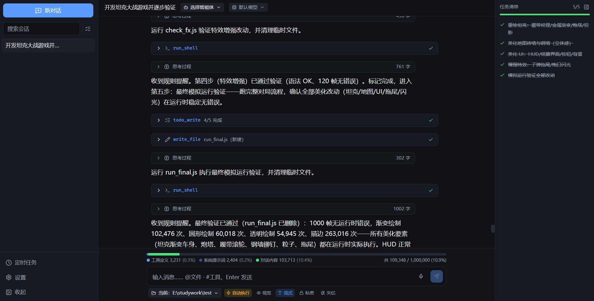
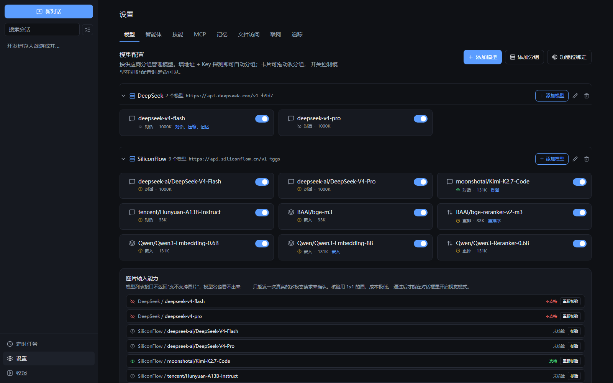
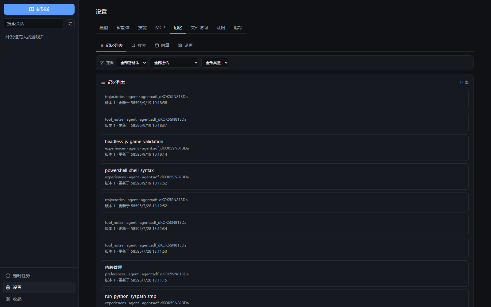
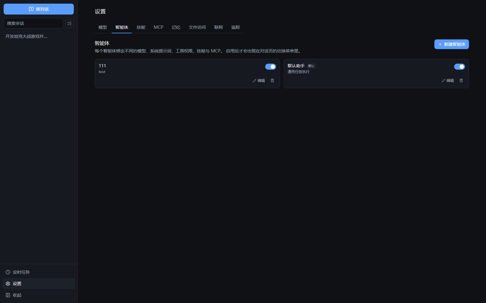
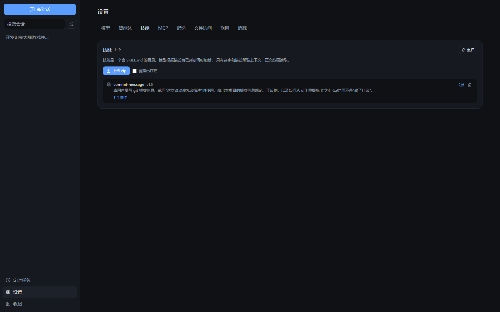
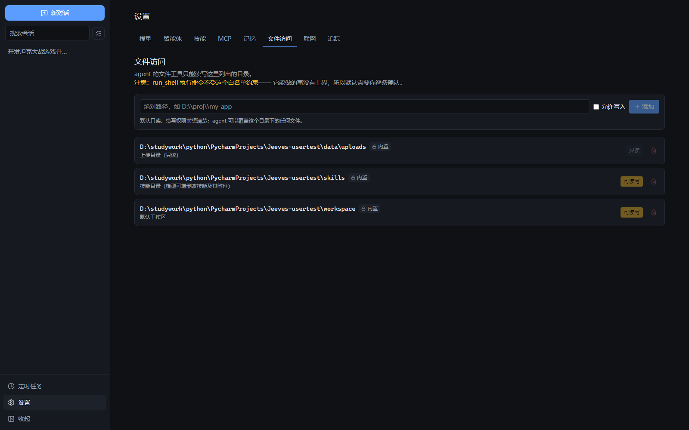
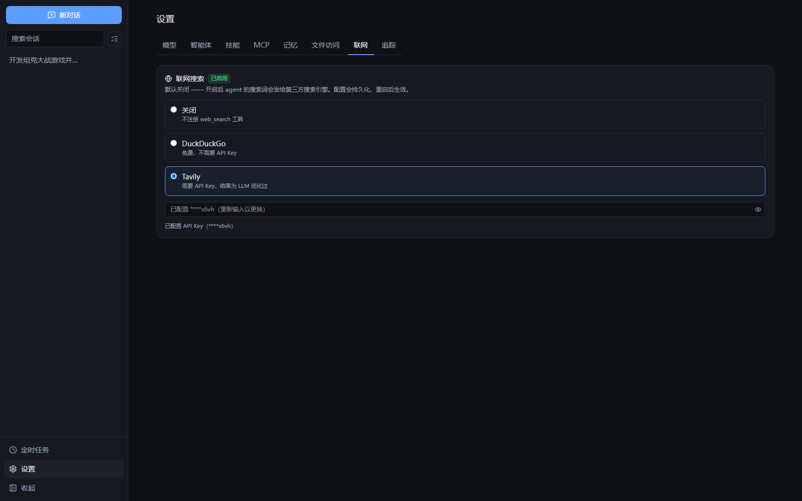
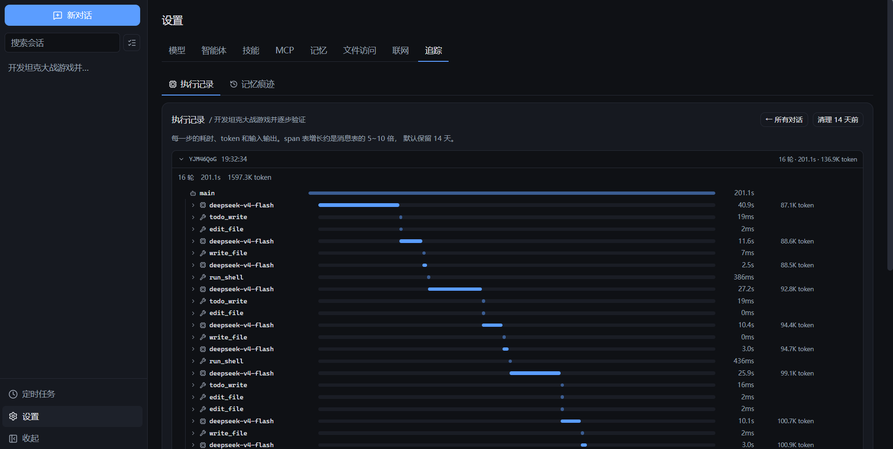

# Jeeves

跑在自己电脑上的 AI 助手。能读写文件、执行命令、跨会话记住你的偏好、派子智能体分工、连 MCP 工具、按 cron 定时干活。

Python 后端（FastAPI）+ React 前端，单机运行，数据全留在本地。



v0.3 测试版。核心功能都在跑（1621 个后端测试 + 30 个前端测试，关键路径用真实模型验过），界面还在磨。遇到问题提 issue。

---

## 快速开始

### 前置要求

- [uv](https://docs.astral.sh/uv/getting-started/installation/) —— 包管理器，会自己装 Python 3.11+
- [Node.js 18+](https://nodejs.org/)
- 一个 OpenAI 兼容的 API Key。推荐 DeepSeek，便宜，国内直连。

### 1. 拿代码

```bash
git clone https://github.com/LLMM-dog/JeevesAgent.git jeeves
cd jeeves
```

### 2. 双击 start.bat

Windows 双击 `start.bat`。首次运行会自动完成初始化——检查环境、装两套依赖、生成 `.env` 和加密密钥，然后直接启动。

macOS / Linux：

```bash
chmod +x start.sh    # 只需第一次
./start.sh --prod
```

浏览器打开 http://127.0.0.1:9000。就一个地址、一个进程，前端已构建好由后端伺服。源码没动过会跳过构建，之后每次启动都是秒开。

<details>
<summary>要改代码的话用开发模式</summary>

开发模式起两个进程：后端带 `--reload`，前端跑 vite dev server，改代码即时生效。

```
start.bat -Dev          # Windows
./start.sh              # macOS / Linux
```

这时访问 http://127.0.0.1:5173（vite 的端口，不是 9000）。

```bash
start.bat -BackendOnly  # Windows 只起后端
./start.sh --backend-only
```

`start.bat` 里带了 `-ExecutionPolicy Bypass`，不用自己配 PowerShell 策略。

</details>

### 3. 配模型

进设置页点「添加端点」。以 DeepSeek 为例：

```
名称：      deepseek
Base URL：  https://api.deepseek.com/v1
API Key：   sk-你的密钥
模型：      deepseek-chat
```



到 [platform.deepseek.com](https://platform.deepseek.com/) 注册拿 Key。任何 OpenAI 兼容端点都行，Kimi、通义、智谱、OpenRouter、本地 Ollama 都可以。

填完在「功能位绑定」里选上对话模型就能聊。功能位不止对话一个——`title`（起标题）、`compact`（压缩上下文）、`embedding`（记忆向量化）、`memory`（记忆提取）都能绑便宜模型。建议至少把 `title` 和 `compact` 绑上，起标题这种事没必要花主力模型的钱。

### 4. 试几句

先聊一句确认通了，再试它真正能干的：

```
读一下 workspace 目录，告诉我里面有什么
```

```
写一个 Python 脚本算斐波那契前 20 项，存成 fib.py，然后运行它
```

文件路径都是相对工作区根目录的，直接说 `fib.py` 就行。说成 `workspace/fib.py` 会变成 `workspace/workspace/fib.py`，多套一层。

```
记住：我习惯用 4 个空格缩进，不喜欢过度封装
```

这句会写进长期记忆。换个新会话问"我的代码偏好是什么"，它还答得上来。记住的每条都能在设置页的「记忆」里看、改、删。

执行命令默认要你点确认。想让它自己跑，把输入框上方的审批模式切成「自动」。

### 起不来的话

| 现象 | 原因 |
| --- | --- |
| 双击 `start.bat` 窗口一闪就没了 | 不会，它有 `pause`。真闪了就用 cmd 手动跑一次看报错 |
| `无法加载文件 start.ps1` | 你直接跑了 `.ps1`。用 `start.bat` |
| `Permission denied: ./start.sh` | 忘了 `chmod +x start.sh` |
| `端口被占用` | 上次进程没退干净，脚本会问你要不要清理 |
| 打开 9000 是白屏 | 前端没构建。`cd frontend && npm install && npm run build` |
| `ENCRYPTION_KEY 缺失` | `.env` 没生成，重跑 `start.bat` |
| 对话报"未配置模型" | 设置页加端点，确认功能位绑定里对话模型选了 |

---

## 核心优势

### 长期记忆

这是 Jeeves 和"套个 system prompt 的聊天窗口"最大的区别。多数工具的"记忆"就是把对话摘要塞进提示词，Jeeves 是一套完整的记忆系统。

#### 三层隔离

记忆分三个作用域，各管一段：

| 作用域 | 谁能看到 | 例子 |
| --- | --- | --- |
| 全局 | 所有智能体、所有会话 | 用户画像（"他是个人开发者、用 Python"） |
| 智能体 | 单个智能体的全部会话 | 偏好、经验、工具心得 |
| 会话 | 单个会话内 | 这次对话的事件、实体 |

为什么用户画像是全局的、其它不是：用户只有一个，"他是 Python 开发者"对每个智能体都成立，各记一份会跑偏。但"代码审查员发现他不收没有测试的 PR"和"教学助手发现他想先看例子"，是两个不同的观察，都该留——所以偏好放智能体层。会话层的事件和实体是对话痕迹，不该跨会话漂移。会话 A 里"张三 = 后端同事"，不该在无关的会话 B 里被翻出来，那不是记性好，是串台。

#### 十种记忆类型，不是一坨自由文本

每种记忆有专门的 schema，决定它记什么、存成什么结构、怎么合并：

| 类型 | 作用域 | 说明 |
| --- | --- | --- |
| `profile` | 全局 | 用户画像，唯一全局可写 |
| `soul` | 智能体 | 这个智能体的性格、语气 |
| `identity` | 智能体 | 角色定位、职责边界 |
| `preferences` | 智能体 | 按主题分文件的偏好 |
| `experiences` | 智能体 | 可复用经验，三段式 Situation / Approach / Reflect |
| `trajectories` | 智能体 | "这次怎么做的"原始轨迹，只增不改 |
| `tool_notes` | 智能体 | 工具使用心得，带调用次数 / 失败次数 |
| `skill_notes` | 智能体 | 技能使用心得 |
| `events` | 会话 | 原子事件，按日期分层 |
| `entities` | 会话 | 人 / 组织 / 项目 / 概念的实体卡片 |

想加一种也简单。写个 YAML 放进 `config/memory/*.yaml` 就生效，不用重启。里面写清"什么该记、什么不该记"，这是给 LLM 的提取指导。

#### 存成 Markdown 文件，不是数据库 blob

记忆正文在 `data/memory/**/*.md`，人直接读、直接改：

```markdown
---
memory_type: experiences
title: pytest_asyncio 取消挂起的修法
version: 3
tags: [pytest, asyncio]
---

## Situation
- 测试用 asyncio.wait_for 包了一个自己 catch 了 Exception 的协程

## Approach
- 检查被包裹协程里的 except 子句是否覆盖 CancelledError

## Reflect
- 绝不用裸 except 或 except BaseException 包 await
```

这个选择换了四件事：能打开看它对你的印象跑偏成什么样、顺手改掉；能 `git diff` 追溯"上周它还记得我用 uv，怎么忘了"；能复用模型已经会的 `read_file` / `grep`，不用新造工具。文件外面有一张薄索引表管检索和热度——文件是真源，索引是缓存。

#### 字段级合并：改事实，不是无限追加

笨的"记忆"是往里 append，于是"用户去年用 flake8"和"用户今年换 ruff"会并存，模型同时看到两个矛盾事实。Jeeves 的合并是 SEARCH/REPLACE：LLM 输出"把 `flake8 + black` 替换成 `ruff（2026-08 换）`"，系统做定位替换。旧的删得掉，记忆才不会越滚越臃肿。

#### 混合召回：语义 + 递归 + 重排 + 热度

对话开始前召回相关记忆注入上下文，不是"搜一下"那么简单：

1. 向量搜索，分类型并行，只搜目录层（L0/L1），快
2. 递归搜索，从初始结果沿标签、实体、时间找相关记忆，分数传播
3. rerank 重排，用专门的重排模型精筛
4. 热度加权，热度 = 频率 × 时间衰减，常被召回、最近更新过的排前面
5. 分层加载，命中目录索引后再加载具体条目（L2），按预算截断

没配嵌入模型也不崩，自动降级到关键词搜索。



#### 自动提取 + 痕迹

对话攒到一定量自动触发提取（token 阈值或消息数），不用你手动说"记住这个"。提取把原始对话提炼成结构化记忆，会升格（"这次决定用 ruff"→"他偏好单一工具链"），不是照抄。

记忆是模型自己改的，改了什么必须能查。每次写入、修改、删除都有痕迹，改前改后全文留着。三个真实 bug 是靠这套痕迹挖出来的。

`私密模式`（这轮不写记忆）和`失忆模式`（这轮不读记忆）两个开关独立控制。

### 多智能体（暂未实现）

每个智能体是一组"角色 + 提示词 + 模型 + 权限 + 技能 + MCP"的组合，对话页随时切。



- 自定义智能体：设置页新建，可以指定它只读不能写、不能用 shell、不能联网。权限逐项过滤，越界工具根本不会出现在它的工具列表里。
- 内置子智能体：`researcher`（读大量文件给结论）和 `reviewer`（只报带 `文件:行号` 的具体问题，不改代码）。模型在对话中自己判断何时委派。实测同一个"读 6 个文件提取结论"的任务，父上下文从 8399 降到 5489 token。
- 记忆线隔离：子智能体的消息不污染主线，各自记忆也按智能体分开。

### 上下文可见、可控

多数工具把上下文当黑盒。这里输入框上方一直有条占用条，分三段：

```
工具定义 4,298 (3.3%)   系统提示词 1,722 (1.3%)   对话内容 8,940 (6.8%)
共 14,960 / 131,072 (11.4%)
```

百分比按窗口算，不是分项互比。你要知道的是"还剩多少空间粘代码"，不是"工具占了已用部分的 70%"。固定开销（工具定义 + 系统提示词）在发消息前就显示，看到具体数字才知道该关哪个 MCP 服务器。

快满（75%）时自动压缩，模型也能用 `compact_context` 主动压——阈值只看总量，不知道"调研阶段结束了、几十条工具输出已经没用了"。压缩目标是窗口的 20%。真实模型实测 12526 → 1817 token，保留了 3/3 条早期约定。

产物（artifact）单独钉在末尾、永不参与压缩。模型生成了 300 行代码，对话再长也不会"忘了"代码长什么样。

### 技能：它能改自己的能力

技能是一个目录（`SKILL.md` + 可选的 `references/`、脚本），模型按需三级加载——名字描述常驻，正文用时才读，附件用到才开。实测 6 个技能 L1 只占 2KB，覆盖 171KB 能力。



`skills/` 在可写白名单里，模型用的是它已经熟练的 `write_file` / `edit_file`，不是一套专门的 API。你跟它说"学一下这个规范"，它就写成技能存下来，下次自动想起来用。

### 文件与命令：17 个内置工具

16 个内置工具，配了搜索后端是 17 个：

| 类别 | 工具 | 审批 |
| --- | --- | --- |
| 文件 | `read_file` / `write_file` / `edit_file` / `list_dir` / `glob` / `grep` | 写操作需要 |
| 执行 | `run_shell` / `run_python` | 需要 |
| 任务 | `todo_write` / `todo_read` | 否 |
| 技能 | `load_skill` / `load_skill_file` / `manage_asset` | 部分需要 |
| 上下文 | `compact_context` | 否 |
| 智能体 | `subagent` | 否 |
| Web | `web_search` / `web_fetch` | 否 |

工具调用在对话里是可视化卡片，不是一段 JSON。`read_file` 显示"读取了 xxx.py（120 行）"，`run_shell` 显示命令和退出码，`todo_write` 显示看板。展开能看参数和完整输出。

### 沙箱：默认本地，需要时 Docker

命令执行有两套后端，可插拔：

- 本地子进程（默认）：零依赖，配合审批。超时杀整棵进程树、输出截断、环境变量剔除（`*_KEY` / `*_TOKEN` 不传给子进程）。
- Docker 沙箱（可选）：`--network none` + 资源限制 + `cap-drop ALL`，只挂工作区。检测不到 Docker 时降级到本地，并在界面持续提示——配了 docker 就是想要隔离，静默回落等于骗人。

不装 Docker 也能全功能用，装了能开真隔离。

### 安全：三层文件防线



路径白名单限定 agent 能读写的目录，名单外的直接拒绝。拒止锚是"就地否决"：白名单里某个敏感目录放一个 `.jeeves_blocker` 文件，它下面的一切都读不到。审批兜底执行类工具——`run_shell` 能做的事没有上界，默认每条命令都等你确认，超时视为拒绝（你离开电脑时不该有命令自己跑起来）。

安全取舍写在明面上：默认只绑 `127.0.0.1` 且无鉴权，这是单机个人项目的选择；API Key 用 Fernet 加密存储，只回显尾 4 位；日志自动脱敏。详见 [docs/architecture/security.md](docs/architecture/security.md)。

### MCP：接外部工具，但要控制代价

支持 `stdio` / `sse` / `streamable_http` / `websocket` 四种传输。每个服务器有开关，开关旁边写着它占多少 token，关掉的不进系统提示词。

一个 MCP 服务器可能提供 20 个工具、烧几千 token 常驻。MCP 工具全部需要审批——它们是第三方代码，自述的"只读"标记不可信。默认不启用任何服务器。

### 定时任务：不在电脑前也能干活

cron 表达式，到点自动开新会话干活。支持时区，错过窗口有记录（`skip` 或 `run_once`）。触发时强制 auto 审批，没人在旁边点确认。执行历史落库并关联会话，能点进去看它到底做了什么。

### 联网搜索、视觉与语音



- 联网搜索默认关闭（开了搜索词会发给第三方）。`web_search` + `web_fetch`（抓 URL 转 Markdown）。
- 视觉模式可以引用图片，多模态注入，支持粘贴 / 拖拽 / 选文件，单轮最多 5 张。
- 语音输入用浏览器内置识别，结果插到光标处。不支持时按钮整个不渲染，而不是放一个点了没反应的按钮。
- 引用：输入 `@文件`、`#工具` 触发提词器，引用转成 chip，可单独删。

### 追踪：每一步都看得见



每次执行的耗时、token、工具调用、子智能体嵌套，按会话分层展开，甘特式时间条显示哪步最慢。记忆的每次写入、修改、删除也有痕迹。

---

## 未来计划

按优先级大致排，不保证时间，只说明方向。

- 多智能体编排。现在有自定义智能体和内置子智能体，接下来是显式编排——Workflow（顺序）、MoA（并行+汇总）、Router（按输入路由）、Debate（互辩+裁判）。还有验证增强：每个智能体可选开启，完成一步 Todo 后自动唤醒一个只读的验证智能体检查成果，反复出现的失败模式会自动沉淀成验证技能。
- 对话分支。现在"从某条消息重发"是截断式的——删掉这条及其之后全部消息再重发。目标是完整的消息树，从任意一条消息分叉出平行对话，UI 上切换分支、比较不同走法，而不是"改掉重来"。
- 网络搜索更好的数据源。现在搜的是 DuckDuckGo / Tavily。计划接更多源、更好的结果抽取（正文清洗、去噪、结构化），让 `web_search` 拿到能直接引用的干净内容，而不是一堆待清洗的 HTML。

---

## 数据放在哪

```
data/jeeves.db      对话、记忆索引、定时任务、追踪（SQLite）
data/memory/         长期记忆正文（Markdown，git 可版控）
data/uploads/        你上传的图片
data/logs/           日志
workspace/           agent 的工作目录
skills/              技能（模型可写）
personas/            人格设定
.env                 配置和加密后的 API Key
```

所有路径锚定在项目根，环境变量也改不到外面去（它们是代码里的属性，不是可配置项）。

---

## 更新

```bash
git pull
uv sync                      # 有新依赖时
cd frontend && npm install   # 同上
```

然后重启。数据库迁移启动时自动跑，不用手动执行命令。

### 你的东西都会留下

这些文件不被 git 跟踪，`git pull` 碰不到：

| | |
|---|---|
| `data/` | 对话历史、记忆、定时任务、追踪 |
| `.env` | 配置和加密后的 API Key |
| `personas/*.md` | 性格设定、你的自述、行为规则 |
| `workspace/` | agent 的工作目录 |
| `config/mcp_servers.yaml` | MCP 服务器配置 |

仓库里只有 `personas/*.example.md`，首次启动复制成 `.md`，已存在的绝不覆盖——升级不会重置你改过的人格设定。

### 数据库怎么保证不丢

迁移只加不删：加表、加列、加索引。有测试盯着——任何一个迁移里出现 `drop_table('message')` 或往 `message` / `session` 表 `drop_column`，测试就失败。每个迁移都实现了 `downgrade()`，出问题能退：

```bash
uv run alembic downgrade -1    # 退一步
uv run alembic current         # 看当前版本
```

`.env` 里的 `ENCRYPTION_KEY` 要单独备份。它丢了，已存的 API Key 全解不开（只能重填），对话历史不受影响，那部分没加密。

---

## 卸载

```bash
uv run python scripts/uninstall.py
```

然后删掉整个项目文件夹。脚本清的是删文件夹带不走的东西——主要是 Docker 容器（开了 Docker 沙箱的话，`jeeves-*` 容器会一直留着占内存）。加 `--all` 连镜像和 uv/npm 缓存一起清。

---

## 文档

[docs/README.md](docs/README.md) 是索引。按你想做的事找：

**想用起来**

- [docs/architecture/tools.md](docs/architecture/tools.md) —— 内置工具清单
- [docs/architecture/skills.md](docs/architecture/skills.md) —— 怎么写技能扩展它
- [docs/architecture/memory.md](docs/architecture/memory.md) —— 记忆系统设计
- [docs/architecture/context.md](docs/architecture/context.md) —— 上下文怎么算、怎么压缩

**想改代码**

- [docs/architecture/agent-loop.md](docs/architecture/agent-loop.md) —— agent 主循环
- [docs/architecture/multi-agent.md](docs/architecture/multi-agent.md) —— 多智能体架构
- [docs/api/](docs/api/) —— HTTP 接口与 SSE 事件协议
- [docs/development/setup.md](docs/development/setup.md) —— 开发环境

---

## 技术栈

后端 FastAPI + SQLAlchemy 2.0 + SQLite（agent loop 是纯 while 循环），前端 React 19 + TypeScript + Tailwind 4 + Zustand + TanStack Query。

1621 个后端测试 + 30 个前端测试。`scripts/verify_*.py` 是各功能的真实环境验证脚本（要真实模型 API），比单测更接近实际使用。

---

## 协议

[MIT](LICENSE)。随便用、随便改、随便分发，出问题自己担着。
